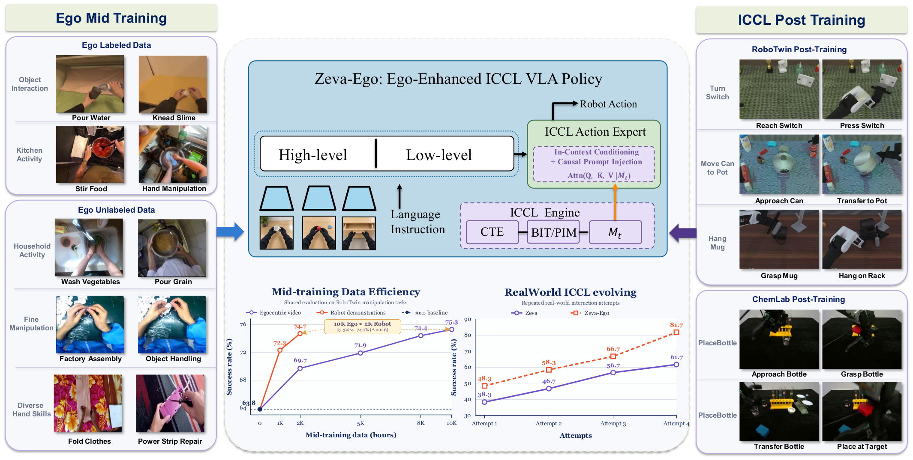

# Zeva-Ego

Zeva-Ego provides an egocentric visual action encoder, memory-augmented RoboTwin policies, and real-robot integration utilities.
[](assets/zeva_ego_teaser.pdf)

## Method

- **CTE — Causal Transition Encoder:** a three-stream Mamba backbone encodes camera observations and previously executed actions.
- **BIT — Brief Interaction Trace:** short-term interaction history within the current attempt.
- **PIM — Persistent Interaction Memory:** preserves completed attempts' BITs for later attempts in the same episode.
- **EAP — Effect Action Prior:** conditions the foundation policy on task memory and interaction effects.

## Ego encoder and independent pipelines

- [Ego action encoder](pipelines/ego_action_encoder/README.md): the two-stage visual action encoder, including models, training recipes, dataset contracts, checkpoints, tests, and RGB-pair inference.
- [RoboTwin Clean](pipelines/robotwin_clean/README.md): the independent RoboTwin data, post-training, normalization, and evaluation package.

These packages are independent of the CTE/BIT/EAP/PIM implementation. Their training code and configuration remain included.

## RoboTwin PIM evaluation

1. Set up the [runtime](docs/README.md) and download the separate [PIM inference checkpoint](scripts/robotwin/README_CHECKPOINT.md).
2. Connect a RoboTwin simulator adapter using the interface in the [evaluation guide](scripts/robotwin/README_EVALUATION.md).
3. Run up to four attempts per frozen episode, stopping on success. The report contains cumulative success rates after attempts 1–4, with a fixed episode denominator.

## Code layout

```text
src/openpi/zeva/
  cte_eap.py              Mamba CTE, EAP, and training objectives
  cte_eap_policy.py       task-memory and training/inference composition
  pim_policy.py          PIM training/inference and memory compression
  pim_release.py         standalone checkpoint verification/loading
  robotwin_contract.py   action, camera, and normalization contracts
  robotwin_policy.py     foundation-policy integration
scripts/robotwin/
  evaluate_multiattempt.py
  multiattempt_protocol.py
  report_multiattempt.py
configs/
  robotwin_multiattempt_original10x20.json
pipelines/
  ego_action_encoder/     visual action encoder training and inference
  robotwin_clean/         independent RoboTwin training and evaluation
```

OpenPI websocket utilities and ALOHA/DROID adapters are retained for [real-robot integration](docs/REAL_ROBOT_DEPLOYMENT.md). The RoboTwin checkpoint is not a ready-to-run real-robot policy: camera, state, action, and safety contracts must match the target robot.

## License

See [LICENSE](LICENSE), [LICENSE_GEMMA.txt](LICENSE_GEMMA.txt), and [THIRD_PARTY_NOTICES.md](THIRD_PARTY_NOTICES.md). Keep the bundled terms with redistributed checkpoints.
